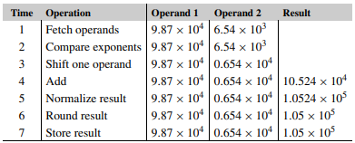
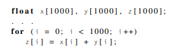

Write-Up by @BryceEJackson

# PDN Programming:  Parallel, Distributed and Network Programming

This repo contains coding practice and notes from: "An Introduction to Parallel Programming",  
by Peter S. Pacheco and Matthew Malensek

#
    CH. 1
#
Why we need ever-increasing performance: 
* We've been enjoying the increases in computational power for decades.
* Advances in fields like science, the internet, and entertainment. 
* With more computational power, our problem solving ability increases. 
* Climate Modeling, Protien Folding, Drug Discovery, Energy Research, Data Analysis...
#
Why we're building parallel systems: 
* Single-processor performance was driven by increasing transistor density. 
* As systems get smaller their clock speeds can be increased, but this uses more energy. 
* Much of this energy is dissipated as heat. 
* Systems have reached their thermal limits for the time being. 
* Because of these facts, we move to improve the parralelism of the systems. 
* a SINGLE CORE system is synonymous to a SINGLE CPU system. 
#
Why we need to write parallel programs: 
* Programs written for single core systems can't exploit the presence of multiple cores. 
* We need to rewrite serial programs so that they run parallel. 
* Conversion of serial C/C++/Java programs to parallel can't be done by a program. 
* Writing parallel programs means creating new algorithms that are different from their serial counterparts. 
#
How we write parallel programs: 
* parallelism requires partitioning the work to be done among the cores. 
* There are two widely used approached: task-parallelism & data-parallelism
* Task Parallelism: partition the various tasks among the cores. 
* Data Parallelism: partition the data among the cores, each core carries out similar operations. 
* matrix multiplication algorithm (Sec. 1.3) is considered to be data-paralelism. 
* The parallel approach requires cores to be coordinated.
* Coordination encompases COMMUNICATION, LOAD BALANCING, and SYNCHRONIZATION. 
* SYNCHRONIZATION brings about the RACE CONDITION. 
#
What we'll be doing: 
* learning to write programs that are explicitly parallel. 
* We will be using the C language, and FOUR API's
* MPI, POSIX threads(Pthreads), OpenMP, and CUDA
* MPI and Pthreads are libraries of type definitions, functions, and macros that can be used in C programs. 
* OpenMP consists of a library and some modifications to the C compiler. 
* CUDA consists of a library and modifications to the C++ compiler. 
* Two Types of Parallel Systems: one is considering the memory that the different cores have access to, the other is to consider whether the cores can operate independently of eachother. 
* We'll cover SHARED and DISTRIBUTED MEMORY systems. 
* SHARED: cores share access to memory. each core can read/write each memory location.
* In a shared memory system, we can coordinate the cores by having them examine and update shared memory locations.
DISTRIBUTED: each core has its own, private memory. cores communicate explicitly by sending mesages across the network.
* MIMD: Multiple Instruction Multiple Data ( Conventional Processors )
* Two cores can execute different instructions in SIMD
* SIMD: Single Instruction Multiple Data( Cores Share Control Unit )
* Two cores either execute the same instruction, or one waits idle until the other is finished executing its instruction.
* MPI is for distributed memory MIMD systems. 
* Pthreads is for shared memory MIMD systems. 
* OpenMP is for shared memory MIMD and SIMD systems, although we will focus on MIMD. 
* CUDA is for Nvidia GPU's, we will focus on shared memory SIMD/MIMD
#
Concurrent, Parallel, and Distributed systems

CONCURRENT: a program has multiple tasks in progress at a time.  
PARALLEL: A program has multiple tasts cooperate to solve a problem.  
DISTRIBUTED: A program may need to cooperate with another program to solve a problem.
#
    CH. 2
#
 The Von Nueman Architecture
  * The Von Nueman Architecture consists of (1) main memory,  (2) a central-processing unit aka CPU, processor or core, (3) and an interconnect between the memory and the core.
 * Main memory consists of a set of locations, each which are capable of storing both data and instructions. 
 * Each location has an ADDRESS and the location's CONTENTS. 
 * the ADDRESS is used to access the location.
 * the CONTENTS of the location is the instruction or data stored there. 
* The CPU or core is divided into the Control Unit and the Data Path. 
* the CU is responsible for deciding which instructions should be executed.
* the Data Path is responsible for executing the actual instructions. 
* Data in the CPU and information about the state of an executing program are stores in very fast storage called REGISTERS.
* the CU has a special register called the program counter. It stores the address of the next instruction to execute.
* The interconnect or bus, is how instructions and data are transfered from the CPU to memory.
* This is the Von Nueman bottleneck, as the interconnect determines the rate at which instructions and data   can be accessd.
#

Processes, multitasking, and threads
* The Operating System or OS determines which programs run and when.
* When a program runs the OS creates a process, an instance of a program that is being executed.
* A process consists of 
    * The executable machine language program
    * A block of memory, which will include   (1) the executable code,  (2) a CALL STACK that keeps track of the active functions, (3) a HEAP that can be used for memory explicitely allocated by the user,  and some other memory locations. 
* Descriptors of resources that the OS has allocated to the process, for example, file descriptors.
* Security Information, for example, information specifying which hardware and software the process can acecss. 
* Information about the state of the processm such as whether the process is ready to run or is waiting on some resource,   the content of the registers, and information about the process's memory.
* Threads need their own CALL STACKs and PROGRAM COUNTER.
* When a thread starts, it forks off a process. 
* When a thread stops, it joins the process.
#
The Basics of Caching

* Caching is a widely used method that addresses the Von Nuemann bottleneck.
* In general, a cache is a collection of memory locations that can be accessed faster than some other locations.
* Caches are much smaller than main memory.
* Caches work on the principle of LOCALLITY, or the idea that a program is most likely to access an instruction that is physically close to the last one is executed. 
* Caches work because branching is less common.
* Cache has different levels with different performance characteristics. 
* L1, L2, L3, etc... are larger and slower as they go 
* When the CPU needs access to data it checks L1 then L2, and so on, before checking main memory.
* "a program will typically access a enarby location ( spatial locality ) in the near future ( temportal locality ). 
* The system uses an effectively wider interconnect to access data and instructions. 
* Memory will effectively operate on blocks of data and instructions instead of individual instructions and individual data items.
* These blocks are called CHACHE BLOCKS or CAHCE LINES 
* A typical cache line stores 8 to 16 times as much information as a single memory location. 
#
Cache Mappings

* When a cache line is fetched from main memory, where in the cache should it be placed? 
* The answer varies from system to system. 
* There is a gradient, with Fully Associaltive caches at one end and Direct Mapped caches at the other. 
* Intermediate schemes are called n-way set associative. 
* When a new line is read to cache, we have to decide which line should be evicted. 
* Least Recently Used is the most common approach. 

#
Caches and Programs: an example

* CPU cache is controlled by system hardware. 
* However, Knowing the principle of spatial and temporal locality allows us to have some indirect control over caching. 
* As an example, C stores 2-dimensional arrays in "row-major" order. 
* effectively, in memory the matrix is a one-dimensional array
* this first pair of nested loops accesses memory in a contiguous way
* becuase of that it will have better performance
---

for(i = 0; i < MAX; i++) 
     for(j = 0; j < MAX; j++)  
        y[i] += A[i][j] * x[j] <br.>

for(j = 0; j < MAX; j++) 
    for(i = 0; i < MAX; i++) 
        y[i] += A[i][j] * x[j] 

---

Virtual Memory
* Developed so that main memory could act as a cache for storage. 
* it exploits spatial & temporal locality by keeping in main memory only the active parts of the many running programs. 
* The idle parts can be kept in secondary storage in something called Swap Space. 
* virtual memory blocks are often called pages. 
* pages are relatively large. ( 4 - 16 kb)
* When a program is compiled its pages are assigned virtual page numbers
* When the page is run a table is created that maps the virtual page numbers to physical addresses. 
* This is known as the PAGE TABLE
* DRAWBACK: can double amount of time to access something in main memory
* to address this, processors have a special address translation cache, called a translation-lookaside buffer
#
**Instruction-level paralellism**

* **ILP** attempts to improve processor performance by having multiple processor components, or functional units,  simultaniously executing instructions. There are Two main types, both of which are used in virtually  every modern processor.

**pipelining** : Piplelines improve performance by taking individual pieces of hardware or functional units and connecting them in sequence. 

 
similar to a factory assembly line. While one team is  
bolting a car's engine to the chassis, another is connecting the  
transmission to the engine and the driveshaft of a car that's  
already been processed by the first team, and a third team can bold  
the body to the chassis in a car thats been processed by the  first two teams.  
As an example involving computation, suppose we want to add the floating  point numbers 9.87 x 104 and 6.54 x 103. Then we can use the following steps. 

   
    
  The above loop would perform serveral floating point additions.
  We can make a piece of hardware for each operation,
  and allow each step to be done simultaniously.
  For the 1000 elements, if each operation takes one nanosecond 
  then this would take 7000 nanoseconds to compute in serial. 
  If each step has a hardware component, then it would only take
  1006 nanoseconds, because each component can do their next step
  while the next component is processing. 
 

2) **multiple issue** : 
 
#
Hardware Multithreading

#
Parallel hardware

#
Classifications of parallal computers

#